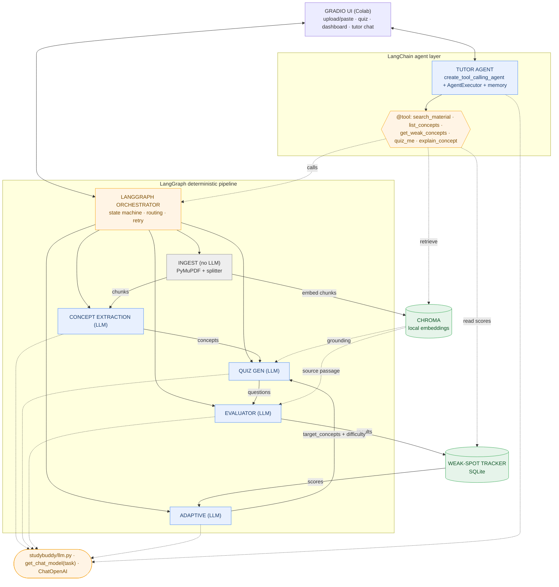
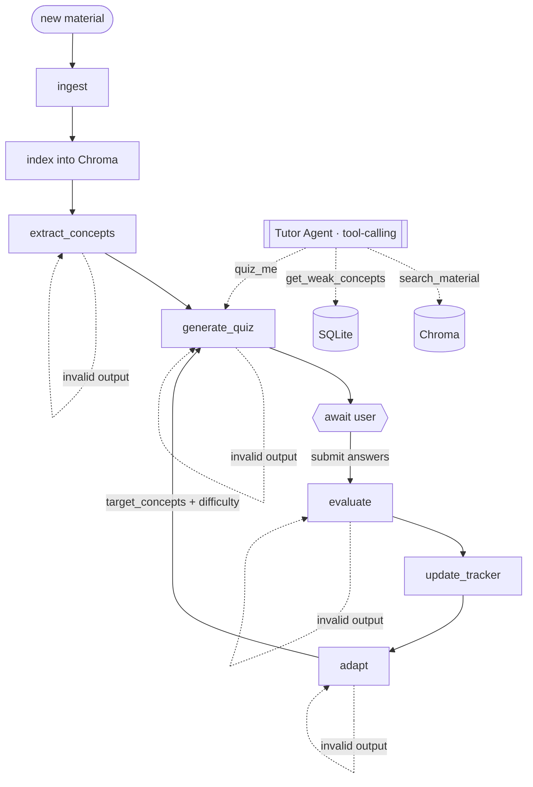

# StudyBuddy — Architecture

**StudyBuddy** is an AI-powered adaptive learning assistant. A student uploads study material
(PDF or pasted notes); StudyBuddy extracts concepts, generates adaptive-difficulty quizzes, grades
answers, tracks weak spots across sessions, re-drills exactly what the student got wrong (at higher
difficulty as mastery grows), and exposes a **conversational tutor agent** that can answer
open-ended questions about the material *and* drive the app (start a quiz, explain a concept, report
weak spots) by calling tools.

This document is the design contract. Each section maps to a file in the package and a phase in
[PHASES.md](PHASES.md), so the system can be built one phase at a time.

---

## 1. Design principles

1. **Specialized agents.** Extraction, generation, grading, adaptation, and tutoring are different
   jobs needing different model behaviors. Each is its own agent with its own prompt and model.
2. **Full LangChain stack.** The project leans on LangChain end to end:
   - **Models** — `langchain_openai.ChatOpenAI` (one factory, env-configured `model` + `base_url`).
   - **Prompts** — `ChatPromptTemplate` + `MessagesPlaceholder`.
   - **Chains** — **LCEL** (`prompt | model | parser`) for the deterministic agents.
   - **Structured output** — `.with_structured_output(PydanticModel)`.
   - **Retrieval** — **Chroma** vector store + LangChain retrievers.
   - **Agent framework** — `create_tool_calling_agent` + `AgentExecutor` with `@tool`-defined tools
     for the conversational Tutor Agent.
   - **Memory** — `RunnableWithMessageHistory` + `ChatMessageHistory` (per-session chat memory).
   - **Observability (optional)** — LangSmith tracing via env vars.
3. **LangGraph for the deterministic pipeline.** The core learning loop (ingest → extract → quiz →
   evaluate → track → adapt) is a **LangGraph** `StateGraph`. The Tutor Agent is the *agentic* layer
   on top that lets the LLM decide which tools (including LangGraph entry points) to invoke.
4. **One LLM client, many models.** Every chat model comes from `get_chat_model(task)`. Pointing
   `OPENAI_BASE_URL` at an OpenAI-compatible gateway lets each agent use a genuinely different model
   (GPT-4o, Claude, Gemini) — the **intelligent routing** requirement.
5. **Local embeddings.** Embeddings run locally via sentence-transformers (no embedding API), so
   retrieval works even when the chat gateway doesn't serve an embeddings endpoint.
6. **Colab-first.** Primary deliverable is a Colab notebook; UI is Gradio launched inline.
7. **Stateful, adaptive, robust.** SQLite persists per-concept performance; Chroma persists embedded
   material; LangGraph retries on malformed structured output.

---

## 2. System diagram



---

## 3. Agent breakdown

| # | Component | LLM? | Model env var | Input → Output |
|---|-----------|------|---------------|----------------|
| 1 | Ingest Agent | No | — | PDF/text → topic chunks + embed into Chroma |
| 2 | Concept Extraction Agent | Yes | `EXTRACTION_MODEL` | chunk → concepts (terms, definitions, ideas) |
| 3 | Quiz Generation Agent | Yes | `QUIZ_MODEL` | concepts + grounding → questions (MCQ/TF/short) |
| 4 | Evaluator Agent | Yes | `EVAL_MODEL` | answer + retrieved source → verdict + explanation |
| 5 | Weak-Spot Tracker | No | — | answers → per-concept scores (SQLite) |
| 6 | Adaptive Agent | Yes | `ADAPTIVE_MODEL` | score table → re-drill concepts + difficulty plan |
| 7 | Tutor Agent (tool-calling) | Yes | `TUTOR_MODEL` | chat msg + tools → answer / app action |
| 8 | Orchestrator | — | (router) | LangGraph state machine over agents 1–6 |

### 3.1 Ingest Agent — `studybuddy/agents/ingest.py`
- **No LLM.** PyMuPDF (`fitz`) for PDFs + pasted-text fallback; LangChain
  **`RecursiveCharacterTextSplitter`** (~1500 chars, ~150 overlap), best-effort `topic`.
- **Indexes chunks into Chroma** (§4.2) with metadata `{session_id, topic, order}`.
- **Output**: `[{ topic, text, order }, ...]`. PPTX/DOCX = optional stretch.

### 3.2 Concept Extraction Agent — `studybuddy/agents/concept.py`
- **Model**: `EXTRACTION_MODEL`. Chain: `ChatPromptTemplate | get_chat_model('extraction').with_structured_output(ConceptList)`.
- 3–5 key ideas/chunk with terms, definitions, relationships; carries `chunk_ref`.

### 3.3 Quiz Generation Agent — `studybuddy/agents/quiz.py`
- **Model**: `QUIZ_MODEL`. Types `multiple_choice|true_false|short_answer`; difficulties `recall|application|analysis`.
- **Retrieves grounding passages from Chroma** for target concepts. Accepts `target_concepts` + `difficulty`.

### 3.4 Evaluator Agent — `studybuddy/agents/evaluator.py`
- **Model**: `EVAL_MODEL`. MCQ/TF graded in code; **short-answer graded against the retrieved source passage**.

### 3.5 Weak-Spot Tracker — `studybuddy/tracker.py`
- **No LLM.** SQLite; `record_answer`, `concept_scores`, `weak_concepts`. Schema in §5.

### 3.6 Adaptive Agent — `studybuddy/agents/adaptive.py`
- **Model**: `ADAPTIVE_MODEL`. `<60%` → re-drill; `>80%` → escalate; else maintain.

### 3.7 Tutor Agent (tool-calling) — `studybuddy/agents/tutor.py` + `studybuddy/tools.py`
The agentic front door and the project's strongest LangChain piece. A
**`create_tool_calling_agent` + `AgentExecutor`** that, given a natural-language message, decides
which tool(s) to call. Wrapped in **`RunnableWithMessageHistory`** for per-session memory.

- **Model**: `TUTOR_MODEL` — **must support tool calling** (e.g. `gpt-4o`, `anthropic/claude-3.5-sonnet`).
- **Prompt**: `ChatPromptTemplate` with a system role, a `MessagesPlaceholder("chat_history")`, the
  human input, and `MessagesPlaceholder("agent_scratchpad")`.
- **Tools** (`@tool` in `studybuddy/tools.py`):
  | Tool | Wraps | Purpose |
  |------|-------|---------|
  | `search_material(query)` | Chroma retriever | RAG answer grounded in the uploaded material (with citations) |
  | `list_concepts()` | concept store | enumerate extracted concepts |
  | `get_weak_concepts()` | `tracker.weak_concepts` | report what the student is struggling with |
  | `quiz_me(topic?, difficulty?)` | LangGraph `start_quiz`/`next_round` | launch a (targeted) quiz round |
  | `explain_concept(name)` | retriever + LLM | explain a concept from the source |
- **Output**: `{ answer: str, sources: [...], actions: [...] }`. Open-ended Q&A is just the
  `search_material` path; "quiz me on cells" triggers `quiz_me`.

### 3.8 Orchestrator — `studybuddy/graph.py` (LangGraph)
- `StateGraph` over agents 1–6; conditional edges on session state; retry-on-malformed-output guard.
- Entry functions: `ingest_material`, `start_quiz`, `submit_answers`, `next_round` — these are what the
  Tutor's tools call, so the agent and the pipeline share one source of truth.

> **Stack note:** LangChain provides models, prompt templates, LCEL chains, structured output,
> retrieval, the **tool-calling agent + tools**, and **memory**. LangGraph provides the deterministic
> pipeline. No provider SDK is used directly — everything is env-configured `ChatOpenAI`.

---

## 4. Models, routing & retrieval

### 4.1 Chat models — `studybuddy/llm.py` + `studybuddy/config.py`

```python
# studybuddy/llm.py  (illustrative)
from langchain_openai import ChatOpenAI
from studybuddy.config import settings, ROUTING

def get_chat_model(task: str, **kw) -> ChatOpenAI:
    return ChatOpenAI(
        model=ROUTING[task],
        base_url=settings.openai_base_url,
        api_key=settings.openai_api_key,
        temperature=kw.get("temperature", 0.2),
    )
```

`config.py` exposes the **task → model routing map**:

```python
ROUTING = {
    "extraction": settings.extraction_model,   # EXTRACTION_MODEL
    "quiz":       settings.quiz_model,          # QUIZ_MODEL
    "evaluation": settings.eval_model,          # EVAL_MODEL
    "adaptation": settings.adaptive_model,      # ADAPTIVE_MODEL
    "tutor":      settings.tutor_model,         # TUTOR_MODEL (tool-calling capable)
    "summary":    settings.summary_model,       # SUMMARY_MODEL (optional)
}
```

### 4.2 Vector store & embeddings — `studybuddy/vectorstore.py`

- **Store**: `langchain_chroma.Chroma`, persisted to `CHROMA_DIR` (default `data/chroma/`).
- **Embeddings**: **local** `langchain_huggingface.HuggingFaceEmbeddings`, model `EMBEDDING_MODEL`
  (default `sentence-transformers/all-MiniLM-L6-v2`). No embedding API call.
- `index_chunks(session_id, chunks)`, `get_retriever(session_id, k=RETRIEVAL_K)` (filters by `session_id`).

### 4.3 Environment variables

| Variable | Required | Example | Used by |
|----------|----------|---------|---------|
| `OPENAI_API_KEY` | yes | gateway key | all chat agents |
| `OPENAI_BASE_URL` | yes | `https://openrouter.ai/api/v1` | all chat agents |
| `EXTRACTION_MODEL` | yes | `gpt-4o` | Concept Extraction |
| `QUIZ_MODEL` | yes | `anthropic/claude-3.5-sonnet` | Quiz Generation |
| `EVAL_MODEL` | yes | `google/gemini-flash-1.5` | Evaluator |
| `ADAPTIVE_MODEL` | yes | `anthropic/claude-3-haiku` | Adaptive |
| `TUTOR_MODEL` | yes | `gpt-4o` (tool-calling) | Tutor Agent |
| `SUMMARY_MODEL` | no | `gpt-4o-mini` | optional summary |
| `EMBEDDING_MODEL` | no | `sentence-transformers/all-MiniLM-L6-v2` | Vector store (local) |
| `CHROMA_DIR` | no | `data/chroma` | Vector store |
| `RETRIEVAL_K` | no | `4` | retrieval depth |
| `STUDYBUDDY_DB` | no | `data/studybuddy.db` | Weak-Spot Tracker |
| `LANGCHAIN_TRACING_V2` | no | `true` | LangSmith tracing (optional) |
| `LANGCHAIN_API_KEY` | no | `ls-...` | LangSmith tracing (optional) |
| `LANGCHAIN_PROJECT` | no | `studybuddy` | LangSmith tracing (optional) |

> ≥3 distinct chat models across agents (e.g. GPT-4o, Claude, Gemini) through one gateway satisfies
> the "integrate at least three different LLMs with intelligent routing" requirement.

---

## 5. Data model (SQLite) — `studybuddy/tracker.py`

```
sessions(session_id PK, created_at, material_name)

concept_scores(
    session_id, concept_id, concept_name,
    attempts INTEGER DEFAULT 0, correct INTEGER DEFAULT 0, streak INTEGER DEFAULT 0,
    last_seen, difficulty TEXT DEFAULT 'recall',
    PRIMARY KEY (session_id, concept_id)
)

quiz_history(
    id PK AUTOINCREMENT, session_id, question_id, concept_id,
    question_type, difficulty, user_answer, correct INTEGER, answered_at
)
```

**Mastery level** (dashboard) from `concept_scores`: `<0.5` red, `<0.8` yellow, `>=0.8` green.
Embedded chunks live in **Chroma** (`CHROMA_DIR`), keyed by `session_id` metadata.

---

## 6. LangGraph session state + agent layer

```python
class StudyState(TypedDict):
    session_id: str
    raw_text: str
    chunks: list
    concepts: list
    quiz: list
    user_answers: dict
    results: list
    round: int
    adaptive_plan: dict
    error: str | None
```

**Flow:**



- LangGraph runs the deterministic loop; the **Tutor Agent** sits beside it and reaches into the same
  Chroma store, tracker, and `generate_quiz`/`start_quiz` entry points via tools.
- Any LLM node returning invalid structured output sets `error` and re-runs (≤ N times) before
  surfacing a graceful failure.

---

## 7. Gradio UI — `studybuddy/ui.py`

Tabs launched with `demo.launch()` (`share=True` in Colab):
1. **Upload / Paste** — PDF upload + paste box → ingest + embed + extract.
2. **Quiz** — current-round questions; per-question feedback.
3. **Dashboard** — concept mastery map (red → yellow → green) + "Start weakness round".
4. **Tutor** — `gr.Chatbot` over the Tutor Agent: ask open-ended questions (RAG, cited) or issue
   commands like "quiz me on mitochondria" / "what am I weak on?" — the agent picks the tool.

---

## 8. How the design meets the grading requirements

| Requirement | How StudyBuddy satisfies it |
|-------------|-----------------------------|
| Handles open-ended queries | A tool-calling **Tutor Agent** answers free-form questions (RAG) and drives actions. |
| Multi-agent architecture | 5 LLM agents + ingest + tracker; deterministic LangGraph pipeline + agentic Tutor. |
| Interactive UI | Gradio app: upload, live quiz, mastery dashboard, conversational tutor. |
| ≥3 LLMs + intelligent routing | Per-task model env vars routed through one OpenAI-compatible gateway. |
| Scalability & adaptability | Modular agents, env-var model swaps, Chroma retrieval, tool-based extensibility. |
| Documentation | This file + [PHASES.md](PHASES.md) + [README.md](README.md) + Colab notebook. |

---

## 9. Limitations

- Educational tool; generated questions, grades, and tutor answers can contain model errors.
- Tutor Agent needs a tool-calling-capable `TUTOR_MODEL`; a model without tool support degrades it to plain chat.
- Image-only / scanned PDFs without a text layer won't extract (no OCR in scope).
- Local embeddings download a sentence-transformers model on first run (CPU is fine for the demo).
- SQLite is single-writer and Chroma is a local store; swap to Postgres / hosted vector DB for scale.

---

## 10. Extended features (Phases 9–17)

Layered on top of the MVP (§1–§9) without changing the core contracts. See
[PHASES.md](PHASES.md) "Extended Phases" for the build order.

### 10.1 Durable session state (Phase 9)
Session artifacts move from an in-process dict to SQLite so they survive restarts. New tables join
the MVP's `sessions` / `concept_scores` / `quiz_history`:

| Table | Purpose |
|-------|---------|
| `documents(session_id, doc_id, name, created_at)` | One row per ingested document. |
| `concepts(session_id, doc_id, concept_id, name, definition, key_terms_json, chunk_ref)` | Extracted concepts, tagged by document. |
| `quizzes(session_id, quiz_id, kind, created_at)` | A generated quiz (kind = round / regenerate / practice / passage). |
| `questions(quiz_id, question_id, concept_id, type, difficulty, prompt, options_json, answer, explanation)` | Questions belonging to a quiz. |

`studybuddy/store.py` keeps its existing function names (`set_concepts` / `get_concepts` /
`set_latest_quiz` / `get_latest_quiz`) but reads/writes these tables, so no caller changes.

### 10.2 New agents & routing keys
| Agent (file) | Routing task | Default model | Role |
|--------------|--------------|---------------|------|
| `agents/flashcards.py` | `flashcards` (env `FLASHCARDS_MODEL`) | = quiz model | Q/A flashcards from concepts. |
| `agents/summarizer.py` | `summary` (existing) | `gpt-4o-mini` | Grounded cheat-sheets per concept/doc. |
| `scheduler.py` | — (no LLM) | — | SM-2 spaced-repetition math. |

`generate_quiz` (Phase 10) gains `question_types`, `num_questions`, and `avoid_questions`, enabling
regenerate / add-more and type/difficulty/count control. The Evaluator (Phase 12) gains
`explain_answer` and accepts an answer `confidence`.

### 10.3 New LangGraph entry functions
Added beside the MVP's `ingest_material` / `start_quiz` / `submit_answers` / `next_round`:
`regenerate_quiz`, `add_questions`, `make_flashcards`, `next_question`, `quiz_passage`. `next_round`
now prioritizes spaced-repetition **due** concepts (Phase 13). `ingest_material` **appends** a
document instead of replacing (Phase 15).

### 10.4 Expanded Tutor toolset
The tool-calling Tutor (§3.7) gains: `regenerate_quiz`, `make_flashcards`, `quiz_passage`,
`explain_answer`, `make_summary` — so every new capability is also agent-drivable, not just UI.

### 10.5 Multi-document retrieval (Phase 15)
Chunks carry a `doc_id` in their Chroma metadata. `get_retriever(session_id, doc_id=None)` filters
by `session_id` for whole-session retrieval or by `session_id + doc_id` to scope to one document.
Concepts and quizzes are tagged by document so the UI can study one doc or all of them.

### 10.6 Progress & export (Phase 16)
`quiz_history.answered_at` powers a per-concept accuracy trend on the Dashboard. `studybuddy/export.py`
renders concepts + latest quiz + results + any summary to a downloadable Markdown file (no new deps).

### 10.7 New env vars (appended to §4.3)
| Var | Default | Used by |
|-----|---------|---------|
| `FLASHCARDS_MODEL` | = `QUIZ_MODEL` | Flashcard generation. |

### 10.8 Updated UI tabs
The Gradio app (§7) gains a **Flashcards** tab and, on existing tabs: quiz controls
(count/type/difficulty/concept + Regenerate/Add-more) and practice toggle on **Quiz**; document list
+ per-doc scope on **Upload**; mastery trend, "due" count, cheat-sheet, and Markdown export on
**Dashboard**.
