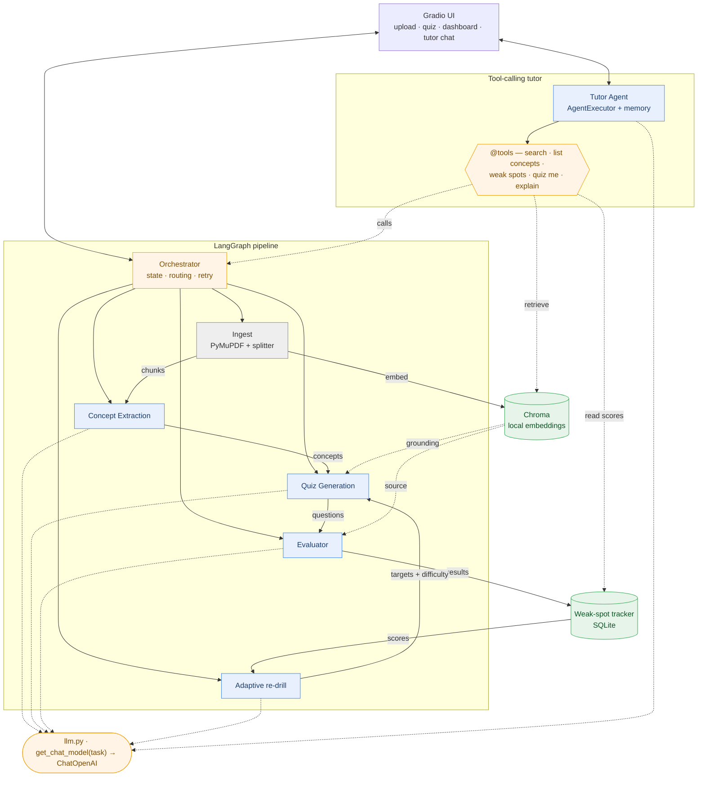

# StudyBuddy — AI-Powered Adaptive Learning Assistant

Upload any study material (PDF or pasted notes). StudyBuddy extracts the key concepts, generates
quizzes at adaptive difficulty, grades your answers, tracks your weak spots across sessions,
**re-drills exactly what you got wrong** (at higher difficulty as you improve), and gives you a
**conversational tutor agent** that answers open-ended questions about your material *and* drives
the app (start a quiz, explain a concept, report weak spots) by calling tools. The system gets
smarter the more you use it: every wrong answer feeds back into what it asks you next.

A multi-agent system built on the full LangChain stack: per-task model routing across several LLMs,
an interactive UI, a tool-calling tutor with RAG, and persistent adaptive state.

**See it in action:** upload a lecture PDF, intentionally answer the biology questions wrong, watch
the next quiz round automatically re-drill exactly those concepts — at higher difficulty — then tell
the tutor "quiz me on the parts I'm weak on" and watch it call the right tools.

---

## How it works

Five specialized agents, each tuned for a different job. Agents 1–4 + adaptation run as a
deterministic LangGraph pipeline; the Tutor is a LangChain tool-calling agent on top.



| Agent | Job | Model (configurable) |
|-------|-----|----------------------|
| **Ingest** | parse PDF / pasted text → topic chunks → embed into Chroma | none (PyMuPDF, local embeddings) |
| **Concept Extraction** | chunks → key terms, definitions, ideas | `EXTRACTION_MODEL` (e.g. GPT-4o) |
| **Quiz Generation** | grounded concepts → MCQ / true-false / short-answer × 3 difficulties | `QUIZ_MODEL` (e.g. Claude 3.5 Sonnet) |
| **Evaluator** | grade answers vs. retrieved source + explain why | `EVAL_MODEL` (e.g. Gemini Flash) |
| **Adaptive** | read weak-spot scores → plan the re-drill | `ADAPTIVE_MODEL` (e.g. Claude 3 Haiku) |
| **Tutor (tool-calling)** | answer open-ended questions (RAG) + drive the app via tools | `TUTOR_MODEL` (e.g. GPT-4o) |

**Stack — the full LangChain ecosystem:** `ChatOpenAI` models, `ChatPromptTemplate` prompts, **LCEL**
chains, `.with_structured_output()` for typed results, **Chroma** retrieval, a **tool-calling agent**
(`create_tool_calling_agent` + `AgentExecutor` with `@tool` tools) with **conversation memory**
(`RunnableWithMessageHistory`), and optional **LangSmith** tracing — orchestrated by **LangGraph**.
Embeddings are **local** sentence-transformers (no embedding API); persistence is **SQLite** + Chroma;
UI is **Gradio**. Every chat model is built by one helper whose `model` + `base_url` come from env vars
— point `OPENAI_BASE_URL` at an OpenAI-compatible gateway (OpenRouter / LiteLLM) to use genuinely
different models per agent.

Full design: **[ARCHITECTURE.md](ARCHITECTURE.md)**.

---

## Quickstart

### 1. Environment
All Python runs through the conda env `mlopsenv`:
```bash
conda run -n mlopsenv pip install -r requirements.txt
```

### 2. Configure
Copy `.env.example` to `.env` and fill in your gateway + per-agent models:
```bash
cp .env.example .env
```
```dotenv
OPENAI_API_KEY=your-gateway-key
OPENAI_BASE_URL=https://openrouter.ai/api/v1   # any OpenAI-compatible gateway
EXTRACTION_MODEL=gpt-4o
QUIZ_MODEL=anthropic/claude-3.5-sonnet
EVAL_MODEL=google/gemini-flash-1.5
ADAPTIVE_MODEL=anthropic/claude-3-haiku
TUTOR_MODEL=gpt-4o                                # must support tool calling
# Retrieval / storage (sensible defaults, no API needed for embeddings)
# EMBEDDING_MODEL=sentence-transformers/all-MiniLM-L6-v2
# CHROMA_DIR=data/chroma
# RETRIEVAL_K=4
# STUDYBUDDY_DB=data/studybuddy.db
# Optional LangSmith tracing
# LANGCHAIN_TRACING_V2=true
# LANGCHAIN_API_KEY=ls-...
# LANGCHAIN_PROJECT=studybuddy
```
Embeddings run **locally** (sentence-transformers), so retrieval works even if your chat gateway
doesn't serve embeddings. Never commit `.env`. Full env-var reference: [ARCHITECTURE.md §4.3](ARCHITECTURE.md).

### 3. Run

**Locally (Gradio):**
```bash
conda run -n mlopsenv python -m studybuddy.ui
```

**In Colab:** open `notebooks/StudyBuddy_demo.ipynb`, set the env vars in the
first cell, then **Runtime → Run all**. The Gradio app launches via a share link.

---

## Project structure

```
FinalProject/
├── README.md                 ← you are here
├── ARCHITECTURE.md           ← system design, agents, data model, env vars
├── requirements.txt
├── .env.example
├── studybuddy/
│   ├── config.py             # env vars + task→model routing + chroma/embedding settings
│   ├── llm.py                # get_chat_model(task) -> ChatOpenAI
│   ├── vectorstore.py        # Chroma + local embeddings: index_chunks() / get_retriever()
│   ├── schemas.py            # Pydantic models for structured outputs
│   ├── tools.py              # @tool definitions for the Tutor Agent
│   ├── agents/{ingest,concept,quiz,evaluator,adaptive,tutor}.py
│   ├── tracker.py            # SQLite weak-spot tracker
│   ├── graph.py              # LangGraph orchestrator
│   └── ui.py                 # Gradio app (Upload · Quiz · Dashboard · Tutor)
├── notebooks/StudyBuddy_demo.ipynb
└── data/                     # studybuddy.db + chroma/ (created at runtime, gitignored)
```

---

## Limitations

StudyBuddy is an **educational tool, not an authoritative assessment**. Generated questions, grades,
and tutor answers can contain model errors, and short-answer grading may be lenient or strict on edge
cases. The Tutor needs a tool-calling-capable `TUTOR_MODEL` (without it, it degrades to plain chat).
Scanned/image-only PDFs without a text layer won't extract (no OCR in scope). Local embeddings
download a sentence-transformers model on first run (CPU is fine for the demo). SQLite is single-writer
and Chroma is a local store — swap to Postgres / a hosted vector DB for multi-user scale.

## Beyond the core loop

Layered on top of the core pipeline (see [ARCHITECTURE.md §10](ARCHITECTURE.md)):

- **Durable state** — concepts and quizzes persist in SQLite across restarts.
- **Flexible quizzes** — pick count, types, difficulty, and concepts; **Regenerate** for different
  questions; **Add more** to grow a round.
- **Study modes** — flashcards, one-at-a-time practice, and "quiz this passage".
- **Richer feedback** — grounded "why was I wrong", plus a confidence rating that weights mastery
  (lucky-guess guard).
- **Spaced repetition** — an SM-2 scheduler surfaces concepts that are due for review.
- **Cheat-sheets** — grounded Markdown summaries per concept/document.
- **Multi-document sessions** — ingest several documents; quiz/search across all or scope to one.
- **Progress & export** — a per-concept accuracy trend chart and a one-click Markdown study pack.

These are also driven conversationally by the Tutor via new tools: `regenerate_quiz`,
`make_flashcards`, `quiz_passage`, `explain_answer`, `make_summary`.

> Requires `langchain-classic` (pinned in `requirements.txt`) for the tool-calling `AgentExecutor`
> on LangChain 1.x.
